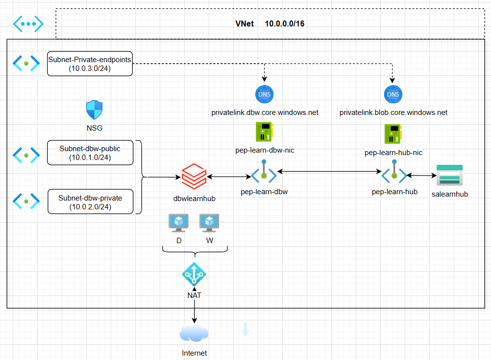

# TerraformLearning
Learn Terraform Basics and try sample code for better understanding. Terraform is IAAC (Infrastructure as a Code) to build cloud infrastructure. As part of our learning, Let's understand about azure resources on a high level and use terraform to build the resources.              

## Project Walk Through
Want to create azure infrastructure with few resources like databricks, storage account under a private and secure network. As part of it I would like to walk through azure and terraform basics highlevel. 

**Note**: NetworkWatcherRG a resource group will be created automatically which is backend service of Network watcher responsible for network monitor, diagnostics and is fully managed by azure.

## Azure Infrastructure

### Azure Architecture - Secure Data Platform

I would like to share a simple secure architecture that emphasizes on how to create resources on a safe and secured network.  

Let's say am building a secure data platform on azure where databricks extracts and writes data to storage account and all traffic must stay private.

Let's go through some networking concepts of azure as it plays major role in further resource setup.

### azure Network Concepts 
1. VNet(Virtual Network) - logical network isolation from other VNet's. Let's say if we block complete 2nd floor in a building for a office other are not allowed.

2. Subnet - Divison within VNet, like we are dividing the space and allocating to different teams.

3. Network Security Groups (NSGs): Firewall rules to control traffic, lets say only people with a valid biometric (employees) can enter into first floor. This protects the flow of entry and exit. Similarly NSG control the flow of network traffic to and from azure resource in azure VNet.

4. NAT Gateway: It connects virtual machines in VNet to outbound internet, It's a managed network address translation service that allows private IP's from your VNet to access the traffic using public static IP. In simple, NAT Gateway displays a single IP address even though multiple vm's are connecting to internet. All the vm's are internally tied to NAT.

5. Private Endpoint (PEP): is a private ip inside your vnet as a private entry point to azure Paas services (like Storage, Key Vault, etc.).Example: you create a PEP for blob storage, it assigns a private IP (eg: 10.0.3.4) inside subnet. 

PEP creates an Network Interface and DNS Configuration for secure and private connectivity

6. Network Interface (NIC): The PEP uses a private IP address from VNet. NIC ensures secure traffic between your VNet and Azure Services(SQL, Storage, App Service) avoiding exposure to public internet.

7. DNS(Domain Name System) Configuration: Azure updates the DNS records to ensure Fully Qualified Domain Name (FQDN) of the service resolves to the private end point IP's address within your VNet like private-app.contoso.com. This involves creating a private DNS Zone pointing to the private IP address.
 
5. Route table: Controls the routing of network traffic within virtual network. Enables to define custom routes that overrides azure default route behavior like directing traffic to specific destinations such as gateways or subnets. It gets associated by default to PEP, also can define custom routes for contorlling the traffic. 

## Terraform
Terraform is infrastructure as code (IAC), that allows you to build, modify and version Infrastructure in safe and efficient manner. The code looks similar to json.

### Download Terraform from below website.
1. Download the terraform exec file from the website https://developer.hashicorp.com/terraform/downloads as per required operating system.
2. Make sure the path of the terraform file is available in environment variables so that it can be executed from any folder in cmd prompt. we will discuss the execution steps below.

**NOTE** - Learning azure infrastructure basics helps to build and execute terraform infrastructure code.

### Root Module Structure:
##### terraform/
    ##### ├── main.tf
    ##### ├── variables.tf
    ##### ├── outputs.tf
    ##### ├── terraform.tfvars (optional)
    ##### ├── Project_SDP/
    ##### │   ├──dev
    ##### │   |  ├──dev.tfvars
    ##### │   |──qa 
    ##### │   |──prod
    ##### └── modules/
    #####     ├── resource_group/
    #####     │   ├── main.tf
    #####     │   ├── variables.tf
    #####     │   └── outputs.tf
    #####     ├── storage_account/
    #####     ├── vnet/
    #####     ├── databricks/
    #####     ├── dns_zone/
    #####     ├── nsg/

### Terraform Concepts/Key Words
Terraform uses the below key words as part of your code build.
1. Provider - Is the API or Application like Azure, AWS or VMWare where infrastructure need to setup
2. Resources - Resource is a infrastructure block in each provider like vitrual machine in azure
3. statefile - After deployment, terraform generates a state file to keep track of current state of the infrastructure, it will use this file to compare the current state of infra with desired state using this file. A file with terraform.tfstate will be created in working directory.

|File                                | Purpose                                                                             |
|------------------------------------|-------------------------------------------------------------------------------------|
|main.tf (module folder)             | Defines sepecific resource(s) for that module, example: modules/databricks/main.tf  |         
|variables.tf (module folder)        | Declares input the module expects from the caller (to be passed from the root)      |
|outputs.tf (module folder)          | Module returns or exposes outputs to root, that can be passed to other modules.     |
|main.tf (root folder)               | Calls modules and wires inputs/outputs together                                     |
|variables.tf (root folder)          | Declares all the variables that root expects to use                                 |
|dev.tfvars (env/project_sdp folder) | Holds environment-specific values (like dev/prod differences)                       |

### Execute Terraform Commands
1. terraform init - This command will download the terraform plugin to interact with the provider, provider can be azure, aws or gcp.
2. terraform validate - To validate our terraform code syntax. 
3. terraform plan - It will read the terraform files created by us, it will validate and check what all resources to be created, kind of simulation. create the state file.
4. terraform apply - providing an approval to create the required resource infrastructure.
5. terraform destroy - This is to remove the current infrastructure in the provider.

### Get Missing State file
       terraform import azurerm_resource_group.rg /subscriptions/xxxxxxxxxxxxx/resourcegroup/subscriptionname

       terraform init -backend-config=".\backend.conf" -reconfigure
   
backend.conf file will specify the resources details where state file needs to be generated. You can place the this file in a folder which is environment specific in order to generate the terraform file.   
https://developer.hashicorp.com/terraform/language/settings/backends/azurerm
     

### Execution Steps
The below steps are executed using any ide, I have used vs code. Open vscode terminal and execute the below below.  
 
#### 1. Login to Azure to perform terraform activity
Execute below commands in the terminal and provider the login, subscription and generate the account list.  
     
       az login  
       az account set -subscription "ejlsjfsiusln"  
       az account list --output table  

#### 2.Terraform commands
Generate current state file of the subscription if any, to make sure nothing impacts with our process, and then execute plan and if no issues then use apply command.  
       
       terraform init 
       terraform plan -var-file="Project_SDP/dev/dev.tfvars" 
       terraform apply -var-file="Project_SDP/dev/dev.tfvars"

#### 3. Delete the existing module.
       terraform destroy --target=module.module_dev   
       or   
       terraform destroy --auto-approve  

